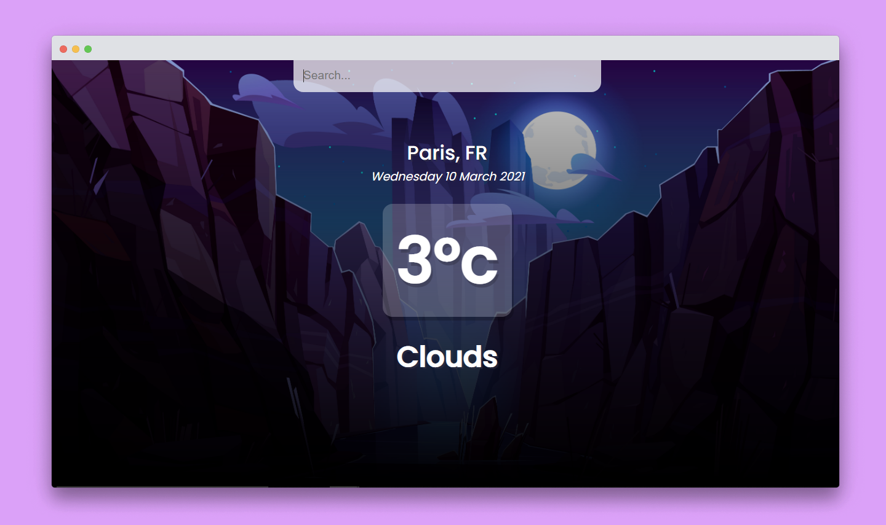

<h1 align="center"> Weather App 🌦️ </h1>

[Weather App](), es una app de clima, que cambia el background dinámicamente dependiendo de la temperatura obtenida por búsqueda de la ciudad o país. También muestra la fecha en tiempo real y los grados centígrados.

**Sólo disfruta de la genialidad** 😉


<hr>

<div align="center">

 </img>

</div>

## Table of Contents

- [Technology Stack](#technology-stack)
- [Installation & Usage](#installation-&-usage)

## Technology Stack

| Technology          | Description                                       | Link ↘️                            |
| --------------------| -----------------------------------------------   | ----------------------------------- |
| HTML5               | Lenguaje de Marcado de Hipertexto                 | ----                                |
| CSS3                | Hoja de cascadas de estilos                       | ----                                |
| JavaScript          | Lenguaje de alto nivel, dinámico e interpretado   | ----                                |
| React               | Framework Front End JavaScript                    | https://reactjs.org/                |
| Webpack             | Empaquetador de módulos de JavaScript             | https://webpack.js.org/             |


## Installation & Usage


_Asegúrese de que [Node.js](https://nodejs.org/en/) y [NPM](https://www.npmjs.com/) estén instalados_


1. Clona o descarga el repositorio (dependiendo de si estás usando SSH o HTTPS)

```
git clone https://github.com/piercenovo/weather-app.git
cd weather-app
```

2. Install dependencies

```
npm i
```

3. Start the application

```
npm start
```

Después de que la aplicación inicie, visite [http://localhost:8080](http://localhost:8080) para verlo en el navegador.

3. Build the application

```
npm run build
```
Se creará una carpeta `dist` donde se encontrarán los archivos comprimidos necesarios para que la app se ejecute correctamente.

<br />

Thanks.. 🚀✨
